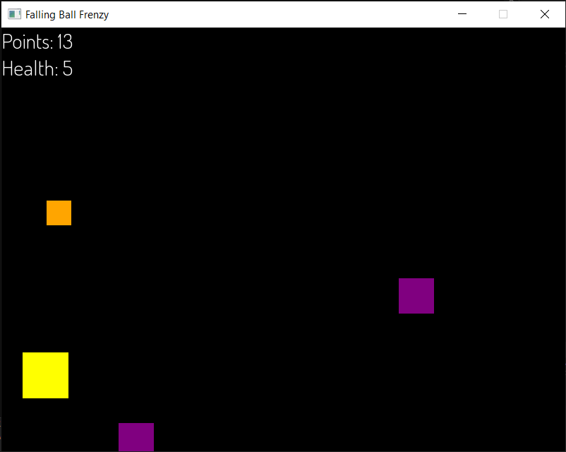

# Falling_Ball_Frenzy



Falling Ball Frenzy is a simple and colorful shooting game developed in C++ using the SFML library. In this game, players must click on falling objects to gain points while avoiding health loss. The game continues until the player's health reaches zero, at which point the game ends.

## Table of Contents

- [Features](#features)
- [Getting Started](#getting-started)
  - [Prerequisites](#prerequisites)
  - [Installation](#installation)
- [How to Play](#how-to-play)
- [Contributing](#contributing)

## Features

- Colorful and engaging gameplay.
- Randomized enemy types and positions.
- Score tracking and health management.
- Responsive mouse-based controls.
- Game over screen with score display.

## Getting Started

### Prerequisites

Before you can run Falling Ball Frenzy, you'll need to have the following prerequisites installed:

- C++ Compiler
- SFML Library ([SFML Installation Guide](https://www.sfml-dev.org/tutorials/2.5/start-linux.php))

### Installation

1. Clone the repository:

   ```sh
   git clone https://github.com/yourusername/color-burst-clicker.git
   ```
2. Compile the game using your C++ compiler and link it with the SFML   library:
   ```sh
   g++ -o FallingBallFrenzy Game.cpp -lsfml-graphics -lsfml-window -lsfml-system
   ```
3. Run the Game
   ```sh
   ./FallingBallFrenzy
   ```
## How to Play
   - Click on falling objects to gain points.
   - Avoid letting the objects reach the bottom of the screen to prevent health loss.
   - Your health will decrease if objects reach the bottom.
   - Smaller the object more points you get.
   - Try to achieve the highest score possible before your health runs out!
   - Press the 'Escape' key to exit the game at any time.

## Contributing
   Contributions to Color Burst Clicker are welcome! If you'd like to contribute to the project, please follow these steps:

   - Fork the project.
   - Create your feature branch (git checkout -b feature/YourFeatureName).
   - Commit your changes (git commit -m 'Add some feature').
   - Push to the branch (git push origin feature/YourFeatureName).
   - Open a pull request.
